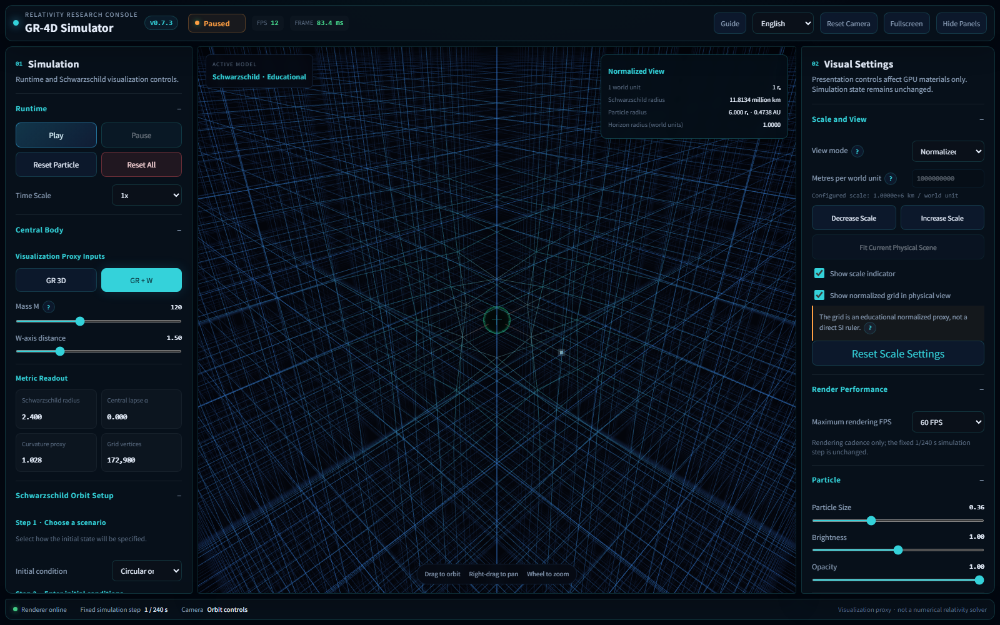
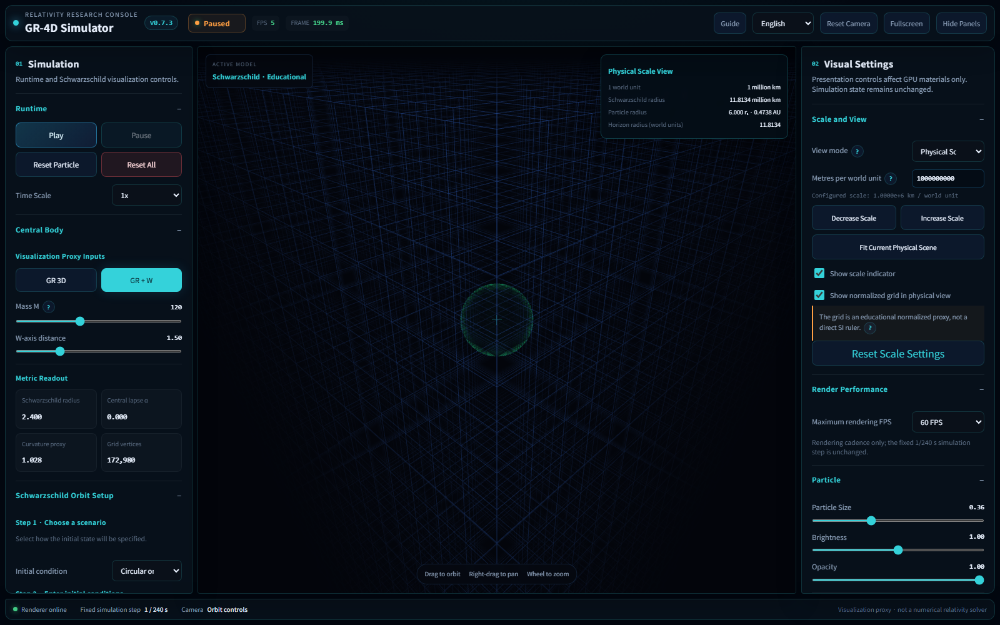
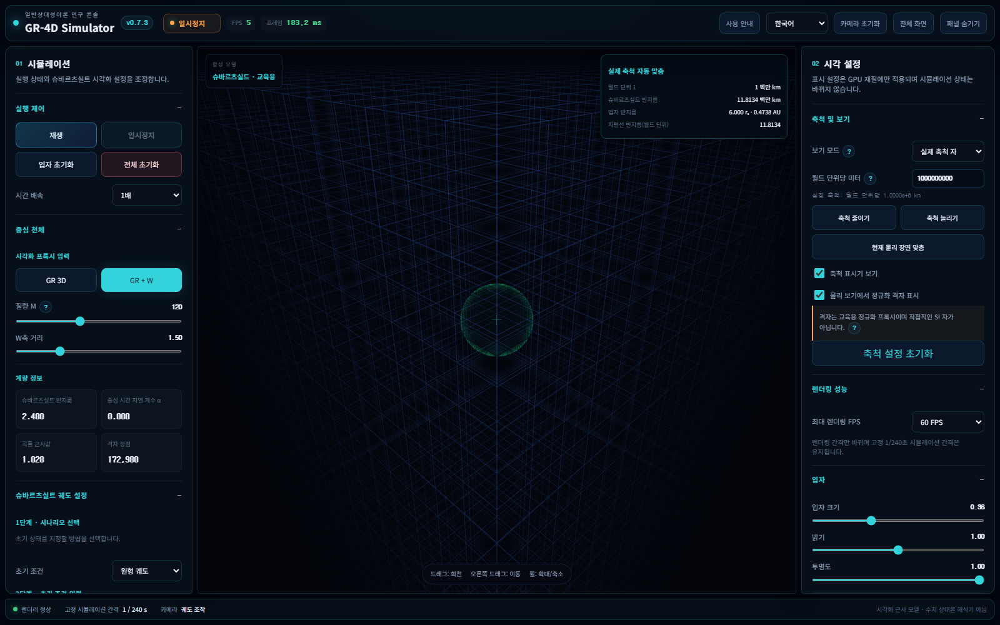
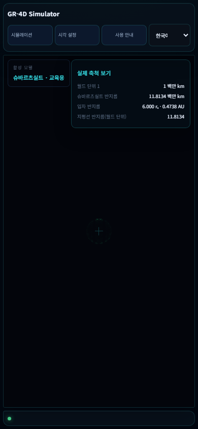
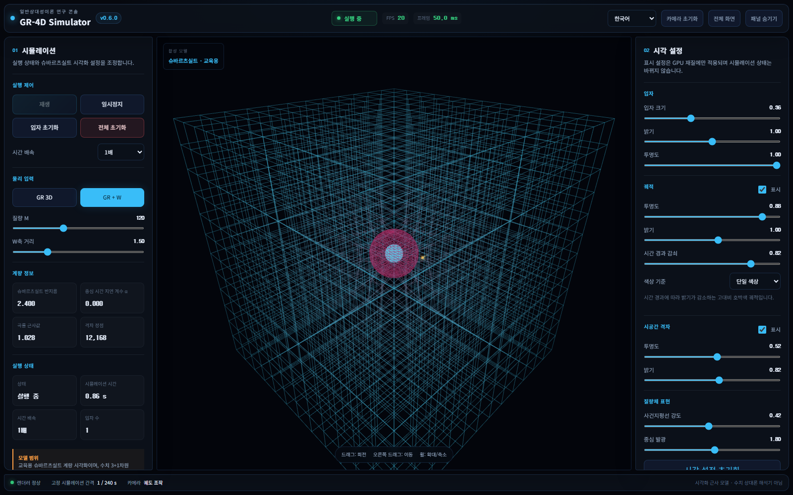
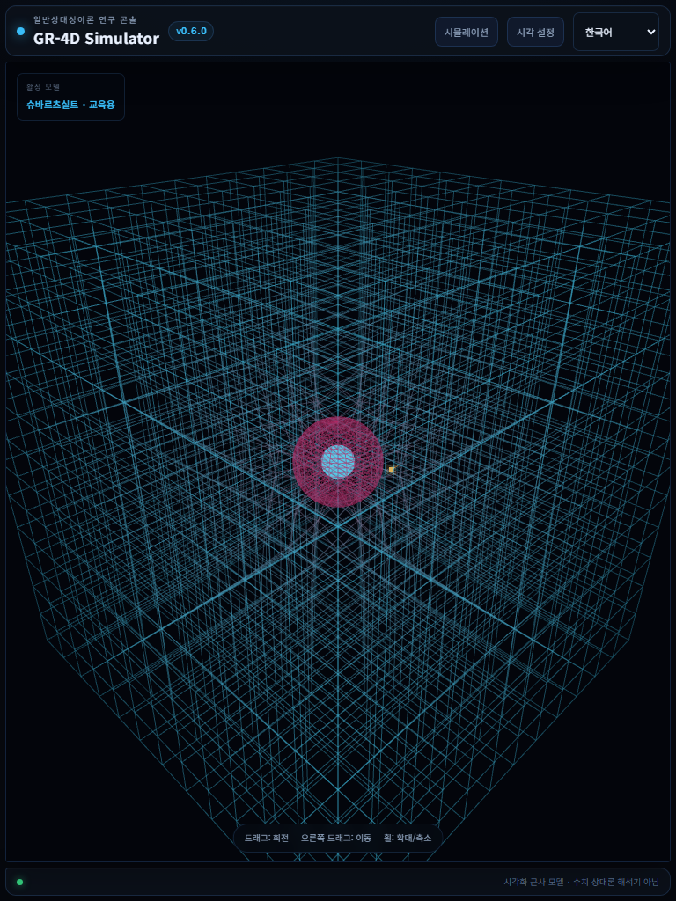
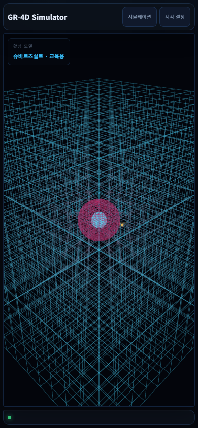

# GR-4D Simulator

A browser-based General Relativity visualization laboratory built with Three.js. Version 0.7.4 adds configurable simulation time scaling and adaptive scientific display units while preserving the v0.7 Schwarzschild physics and SI state.

User documentation: [scientific user guide](docs/USER_GUIDE.md) · [glossary](docs/GLOSSARY.md)

> This project is not yet a numerical Einstein field equation solver. The current implementation combines quantities derived from the Schwarzschild metric with explicitly documented weak-field visualization approximations.

## Current capabilities

- Three.js volumetric grid visualization
- Single Schwarzschild mass and event-horizon representation
- Schwarzschild radius, lapse, and curvature proxy metrics
- GR 3D and GR + W effective-distance comparison
- Real-time mass and W-axis controls
- OrbitControls camera navigation
- Fixed-timestep runtime controls and one default test particle
- GPU-buffered particle trail rendering
- Responsive simulation and visual-settings panels
- Presentation-only particle, trail, grid, and mass-rendering controls
- Live Korean/English interface switching with persisted language preference
- Explicit cleanup of renderer, controls, geometry, material, and subscriptions
- Uniform finite-domain grid and independent maximum-render-FPS controls
- Normalized (`r_s = 1`) and SI-derived physical-scale views with event-driven camera fitting
- Preset and custom `0.01×–100000×` simulation time scales without resetting orbit state or trails
- Automatic, strict SI, and astronomy-oriented display-unit policies persisted under `gr4d.displayUnits`

## Quick start

Requirements: Node.js 20.19 or newer (or Node.js 22.12+) and npm.

```bash
npm install
npm run dev
```

Production verification:

```bash
npm run lint
npm run test
npm run build
npm run test:smoke
npm run preview
```

For a local production preview that is reachable outside the local machine:

```bash
npm run build
npm run preview -- --host 0.0.0.0
```

`vite preview` is a local verification server, not the production hosting server.

## Deployment

The expected production URL is [https://ogw07222-tech.github.io/gr-simulator/](https://ogw07222-tech.github.io/gr-simulator/). Pushes to `main` automatically run lint, unit tests, a production build, artifact upload, and deployment through the **Deploy GitHub Pages** workflow. A deployment is successful only after both workflow jobs complete successfully.

Deployment status and logs are available in the repository's **Actions** tab. The same workflow can be rerun with **Run workflow**. The repository owner must select **Settings → Pages → Build and deployment → Source → GitHub Actions** once before the first deployment.

GitHub Pages serves this repository from `/gr-simulator/`. The deployment workflow enables that Vite base path while localhost and Codespaces retain `/`. See [Deployment](docs/DEPLOYMENT.md) for validation, local Pages preview, permissions, and future custom-domain guidance.

Only `.github/workflows/deploy-pages.yml` publishes the site, and it uploads the generated `dist` directory rather than repository sources. Release validation is version-aware: patch releases use the full English visual matrix plus automated locale parity and targeted Korean checks; minor and major releases use the full bilingual matrix. Localization- or layout-affecting patch changes trigger the relevant Korean visual exception. See [Contributing](CONTRIBUTING.md).

The first browser-smoke run requires `npx playwright install chromium`. Unit tests use Vitest with jsdom; browser smoke tests run the actual application in Chromium.

## Controls

- Drag: rotate camera
- Right-drag: pan camera
- Mouse wheel: zoom
- GR 3D / GR + W: select the effective-distance model
- Mass M / W-axis distance: update simulation inputs
- Play / Pause / Time Scale: control the existing fixed-step runtime
- Reset Particle / Reset All: restore particle or complete runtime time state
- Visual Settings: adjust rendering materials without changing simulation state
- Scale and View: switch between normalized, fixed physical, and auto-fit physical presentation; configure metres per world unit
- Reset Camera / Fullscreen / Hide Panels: manage the scientific workspace
- 한국어 / English: switch the complete interface language without resetting simulation, camera, or visual state

## Localization

English (`en`) is the default interface language. Korean (`ko`) remains fully supported. The language selector restores a valid previous choice from the `gr4d.locale` localStorage key; invalid values fall back to English. Locale dictionaries live in `src/ui/i18n/en.js` and `src/ui/i18n/ko.js`, while `src/ui/i18n.js` provides the stable runtime API. Switching language updates document metadata, visible labels, and accessibility text without reloading or resetting simulation state.

Translations use stable keys in `src/ui/i18n.js`. To add a language, add a complete dictionary matching the existing `ko` and `en` keys, register its locale code in `SUPPORTED_LOCALES`, and add the selector label. Project name, FPS, GR, GPU, scientific units, and mathematical symbols remain untranslated where appropriate.

## Scientific dashboard

The scale selector is a presentation boundary. Normalized mode maps one world unit to one Schwarzschild radius. Physical modes convert the same normalized particle, trail, and horizon coordinates with `r_s / metresPerWorldUnit`; changing view never changes solver state, energy, angular momentum, classification, or time. The grid remains a normalized educational deformation proxy and is explicitly labelled as not being an SI spatial lattice.

| Normalized (English) | Physical (English) | Auto-fit physical (Korean) | Physical mobile (Korean) |
| --- | --- | --- | --- |
|  |  |  |  |

The v0.6.2 interface uses an original scientific-dashboard design language: compact telemetry, restrained accents, a viewport-first layout, and separate simulation and presentation controls. Grid deformation and trail speed include explicit legends. Desktop uses persistent side panels; tablet and mobile use keyboard- and touch-accessible drawers.

The grid uniformly covers the supported `[-75, 75]³` world domain at five-unit spacing. The boundary derives from maximum mass 300, a maximum supported orbital radius of `10 r_s`, and a 1.25 safety margin. Camera distance never changes grid topology or omits visible far sections. Raw model displacement remains unchanged; a documented `asinh` transfer applies only to display magnitude. Particles attempting to leave the domain retain their last valid state and are classified separately from capture.

The complete supported grid is rendered with uniformly sampled indexed chunks. Native frustum culling may skip a chunk only when its bounds are entirely outside the view; camera distance never changes visible topology or opacity. The maximum FPS selector caps rendering at 30, 45, 60, 90, 120 FPS or leaves it unlimited while the simulation remains fixed at 240 Hz.

Screenshots are maintained in `docs/screenshots/` for desktop, tablet, and mobile verification. See [UI architecture](docs/UI_ARCHITECTURE.md) for theme tokens, supported visual settings, responsive behavior, and intentionally unsupported controls.

| Desktop | Tablet portrait | Mobile portrait |
| --- | --- | --- |
|  |  |  |

## Architecture

```text
src/
├─ core/       # Configuration, state, shared runtime primitives
├─ physics/    # Framework-independent physical models
├─ rendering/  # Three.js renderer and scene representations
├─ ui/         # Interactive controls and presentation styles
├─ hud/        # Read-only metrics projection boundary
├─ systems/    # Lifecycle, clocks, and orchestration boundary
├─ utils/      # Small framework-independent helpers
└─ main.js     # Composition root
```

Each directory exposes or reserves a clear dependency boundary. Existing v0.1 behavior remains assembled in `main.js`; future migrations will move orchestration behind systems only after regression tests exist. See [Architecture](docs/ARCHITECTURE.md) and [Module Boundaries](docs/MODULES.md).

## Research direction

The long-term goal is a reproducible, testable, performance-oriented GR simulation platform. Physical observables, educational proxies, and visual effects must remain separately named and validated. Numerical methods will be introduced only with reference cases, error bounds, and benchmark budgets.

## Project documentation

Detailed, automatically generated repository metrics are available in [Project Statistics](PROJECT_STATS.md). Regenerate them with `npm run stats`.

- [Physics model](docs/PHYSICS.md)
- [Architecture](docs/ARCHITECTURE.md)
- [Module boundaries](docs/MODULES.md)
- [Runtime engine](docs/RUNTIME_ENGINE.md)
- [Particle engine](docs/PARTICLE_ENGINE.md)
- [UI architecture](docs/UI_ARCHITECTURE.md)
- [Rendering performance architecture](docs/RENDERING_ARCHITECTURE.md)
- [Deployment](docs/DEPLOYMENT.md)
- [Contributing](CONTRIBUTING.md)
- [Roadmap](ROADMAP.md)
- [Task backlog](TODO.md)
- [Changelog](CHANGELOG.md)

## Development principles

- Preserve existing behavior and public interactions.
- Prefer measured performance work over speculative rewrites.
- Keep physics independent from Three.js and the DOM.
- Avoid per-frame allocations in performance-critical paths.
- Require deterministic tests and documented tolerances for numerical changes.
- Make ownership and disposal explicit for every runtime resource.

## License

[MIT](LICENSE)

## v0.7 Schwarzschild physics

The default test particle is evolved by the fixed-step runtime through an equatorial timelike Schwarzschild geodesic subsystem. The orbit panel supports analytic circular data, local static-observer velocity components, and advanced conserved quantities. Draft values take effect only after validation and Apply. Live SI and normalized diagnostics are read from immutable snapshots.

Use `npm run test:physics` for analytic and long-orbit regression tests and `npm run benchmark:physics` for the solver-only scaling sample. See [Unit System](docs/UNIT_SYSTEM.md), [Geodesics](docs/SCHWARZSCHILD_GEODESICS.md), [Numerical Integration](docs/NUMERICAL_INTEGRATION.md), [Classification](docs/ORBIT_CLASSIFICATION.md), and [Validation](docs/VALIDATION.md).
